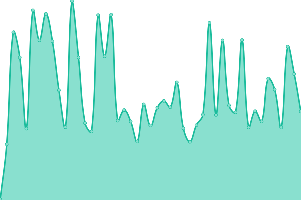

# [📈 Live Status](https://BCIT-LTC.github.io/status): <!--live status--> **🟧 Partial outage**

This repository contains the open-source uptime monitor and status page for [BCIT Learning and Teaching Centre](https://course-production.ltc.bcit.ca), powered by [Upptime](https://github.com/upptime/upptime).

With [Upptime](https://upptime.js.org), you can get your own unlimited and free uptime monitor and status page, powered entirely by a GitHub repository. We use [Issues](https://github.com/BCIT-LTC/status/issues) as incident reports, [Actions](https://github.com/BCIT-LTC/status/actions) as uptime monitors, and [Pages](https://BCIT-LTC.github.io/status) for the status page.

<!--start: status pages-->
<!-- This summary is generated by Upptime (https://github.com/upptime/upptime) -->
<!-- Do not edit this manually, your changes will be overwritten -->
<!-- prettier-ignore -->
| URL | Status | History | Response Time | Uptime |
| --- | ------ | ------- | ------------- | ------ |
|  [cdn](https://commoncdnkztu547l.blob.core.windows.net/cdn/bcit-ltc/common/branding/1.0.0/alive.html) | 🟩 Up | [cdn.yml](https://github.com/bcit-ltc/status/commits/HEAD/history/cdn.yml) | 

 146ms
     
 | 

<a href="https://BCIT-LTC.github.io/status/history/cdn">100.00%</a>
    

|  [Common (cdn loader)](https://common.ltc.bcit.ca) | 🟩 Up | [common-cdn-loader.yml](https://github.com/bcit-ltc/status/commits/HEAD/history/common-cdn-loader.yml) | 

 1047ms
     
 | 

<a href="https://BCIT-LTC.github.io/status/history/common-cdn-loader">100.00%</a>
    

|  [Conversion Guide](https://conversion-guide.ltc.bcit.ca) | 🟩 Up | [conversion-guide.yml](https://github.com/bcit-ltc/status/commits/HEAD/history/conversion-guide.yml) | 

 954ms
     
 | 

<a href="https://BCIT-LTC.github.io/status/history/conversion-guide">100.00%</a>
    

|  [CORGI](https://corgi.ltc.bcit.ca) | 🟩 Up | [corgi.yml](https://github.com/bcit-ltc/status/commits/HEAD/history/corgi.yml) | 

 616ms
     
 | 

<a href="https://BCIT-LTC.github.io/status/history/corgi">100.00%</a>
    

|  [Course Workload Estimator](https://course-workload-estimator.ltc.bcit.ca) | 🟩 Up | [course-workload-estimator.yml](https://github.com/bcit-ltc/status/commits/HEAD/history/course-workload-estimator.yml) | 

 890ms
     
 | 

<a href="https://BCIT-LTC.github.io/status/history/course-workload-estimator">100.00%</a>
    

|  [H5P](https://h5p.commons.bcit.ca) | 🟩 Up | [h5-p.yml](https://github.com/bcit-ltc/status/commits/HEAD/history/h5-p.yml) | 

 476ms
     
 | 

<a href="https://BCIT-LTC.github.io/status/history/h5-p">94.95%</a>
    

|  [Learning Hub](https://learn.bcit.ca/shared/header.htm) | 🟩 Up | [learning-hub.yml](https://github.com/bcit-ltc/status/commits/HEAD/history/learning-hub.yml) | 

 286ms
     
 | 

<a href="https://BCIT-LTC.github.io/status/history/learning-hub">100.00%</a>
    

|  [Legacy apps](https://ltc.bcit.ca/multimedia/) | 🟩 Up | [legacy-apps.yml](https://github.com/bcit-ltc/status/commits/HEAD/history/legacy-apps.yml) | 

 305ms
     
 | 

<a href="https://BCIT-LTC.github.io/status/history/legacy-apps">100.00%</a>
    

|  [qcon-web](https://qcon-web.ltc.bcit.ca) | 🟩 Up | [qcon-web.yml](https://github.com/bcit-ltc/status/commits/HEAD/history/qcon-web.yml) | 

 956ms
     
 | 

<a href="https://BCIT-LTC.github.io/status/history/qcon-web">100.00%</a>
    

|  [qcon-api](https://qcon-api.ltc.bcit.ca) | 🟩 Up | [qcon-api.yml](https://github.com/bcit-ltc/status/commits/HEAD/history/qcon-api.yml) | 

 359ms
     
 | 

<a href="https://BCIT-LTC.github.io/status/history/qcon-api">100.00%</a>
    

|  [Sugar Suite](https://sugar-suite.ltc.bcit.ca) | 🟩 Up | [sugar-suite.yml](https://github.com/bcit-ltc/status/commits/HEAD/history/sugar-suite.yml) | 

 940ms
     
 | 

<a href="https://BCIT-LTC.github.io/status/history/sugar-suite">100.00%</a>
    

|  [ETS Online Help Centre](https://www.techhelpbcit.ca/) | 🟥 Down | [ets-online-help-centre.yml](https://github.com/bcit-ltc/status/commits/HEAD/history/ets-online-help-centre.yml) | 

 497ms
     
 | 

<a href="https://BCIT-LTC.github.io/status/history/ets-online-help-centre">94.96%</a>
    

<!--end: status pages-->

[**Visit our status website →**](https://BCIT-LTC.github.io/status)

## 📄 License

- Powered by: [Upptime](https://github.com/upptime/upptime)
- Code: [MIT](./LICENSE) © [BCIT Learning and Teaching Centre](https://course-production.ltc.bcit.ca)
- Data in the `./history` directory: [Open Database License](https://opendatacommons.org/licenses/odbl/1-0/)
