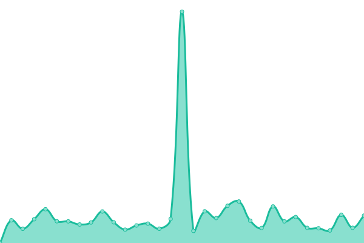

# [📈 Live Status](https://BCIT-LTC.github.io/status): <!--live status--> **🟩 All systems operational**

This repository contains the open-source uptime monitor and status page for [BCIT Learning and Teaching Centre](https://course-production.ltc.bcit.ca), powered by [Upptime](https://github.com/upptime/upptime).

With [Upptime](https://upptime.js.org), you can get your own unlimited and free uptime monitor and status page, powered entirely by a GitHub repository. We use [Issues](https://github.com/BCIT-LTC/status/issues) as incident reports, [Actions](https://github.com/BCIT-LTC/status/actions) as uptime monitors, and [Pages](https://BCIT-LTC.github.io/status) for the status page.

<!--start: status pages-->
<!-- This summary is generated by Upptime (https://github.com/upptime/upptime) -->
<!-- Do not edit this manually, your changes will be overwritten -->
<!-- prettier-ignore -->
| URL | Status | History | Response Time | Uptime |
| --- | ------ | ------- | ------------- | ------ |
|  [Legacy LTC](https://ltc.bcit.ca/multimedia/) | 🟩 Up | [legacy-ltc.yml](https://github.com/BCIT-LTC/status/commits/HEAD/history/legacy-ltc.yml) | 

 427ms
     
 | 

<a href="https://BCIT-LTC.github.io/status/history/legacy-ltc">100.00%</a>
    

|  [Sugar Suite](https://sugar-suite.ltc.bcit.ca) | 🟩 Up | [sugar-suite.yml](https://github.com/BCIT-LTC/status/commits/HEAD/history/sugar-suite.yml) | 

 458ms
     
 | 

<a href="https://BCIT-LTC.github.io/status/history/sugar-suite">100.00%</a>
    

|  [CORGI](https://corgi.ltc.bcit.ca) | 🟩 Up | [corgi.yml](https://github.com/BCIT-LTC/status/commits/HEAD/history/corgi.yml) | 

 705ms
     
 | 

<a href="https://BCIT-LTC.github.io/status/history/corgi">100.00%</a>
    

|  [Commons H5P](https://h5p.commons.bcit.ca) | 🟩 Up | [commons-h5-p.yml](https://github.com/BCIT-LTC/status/commits/HEAD/history/commons-h5-p.yml) | 

 711ms
     
 | 

<a href="https://BCIT-LTC.github.io/status/history/commons-h5-p">100.00%</a>
    

|  [Conversion Guide](https://conversion-guide.ltc.bcit.ca) | 🟩 Up | [conversion-guide.yml](https://github.com/BCIT-LTC/status/commits/HEAD/history/conversion-guide.yml) | 

 484ms
     
 | 

<a href="https://BCIT-LTC.github.io/status/history/conversion-guide">100.00%</a>
    

|  [Course Workload Estimator](https://course-workload-estimator.ltc.bcit.ca) | 🟩 Up | [course-workload-estimator.yml](https://github.com/BCIT-LTC/status/commits/HEAD/history/course-workload-estimator.yml) | 

 424ms
     
 | 

<a href="https://BCIT-LTC.github.io/status/history/course-workload-estimator">100.00%</a>
    

|  [Qcon](https://qcon.ltc.bcit.ca) | 🟩 Up | [qcon.yml](https://github.com/BCIT-LTC/status/commits/HEAD/history/qcon.yml) | 

 409ms
     
 | 

<a href="https://BCIT-LTC.github.io/status/history/qcon">100.00%</a>
    

<!--end: status pages-->

[**Visit our status website →**](https://BCIT-LTC.github.io/status)

## 📄 License

- Powered by: [Upptime](https://github.com/upptime/upptime)
- Code: [MIT](./LICENSE) © [BCIT Learning and Teaching Centre](https://course-production.ltc.bcit.ca)
- Data in the `./history` directory: [Open Database License](https://opendatacommons.org/licenses/odbl/1-0/)
